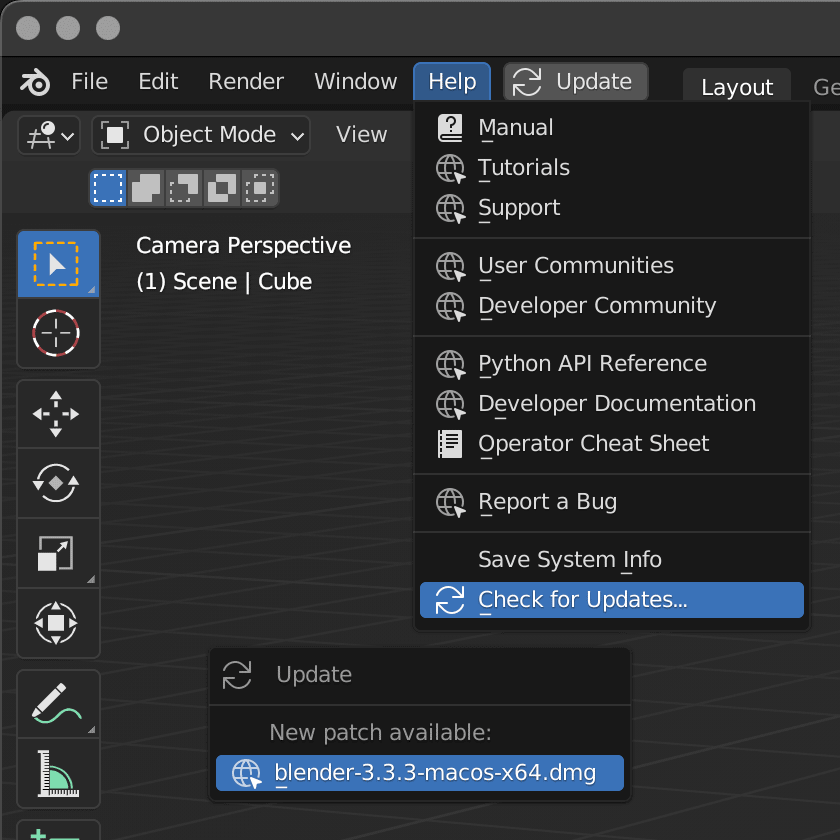

# AN7 Check For Blender Updates

Check for Blender patch updates from the Help menu and automatically on startup.

## Installation and Usage

 - Download the .py add-on file
 - Install in the Blender Preferences > Add-ons tab
 - Enable the plugin
 - Choose the correct download type (this is not auto-detected and must be set manually)

If `Automatically Check for Updates` is enabled and a new patch is found on startup, an update button will appear in the main menu.

Click this button to open the update popup with a download link (it'll download using your default browser), or access the same popup window at any time from the `Help` menu (this is an easy way to confirm you're running the latest available version if Blender hasn't been restarted in a while).

Works in Blender 2.83, 2.93, and 3.3 for MacOS Intel, other versions and platforms should work but have not be tested.