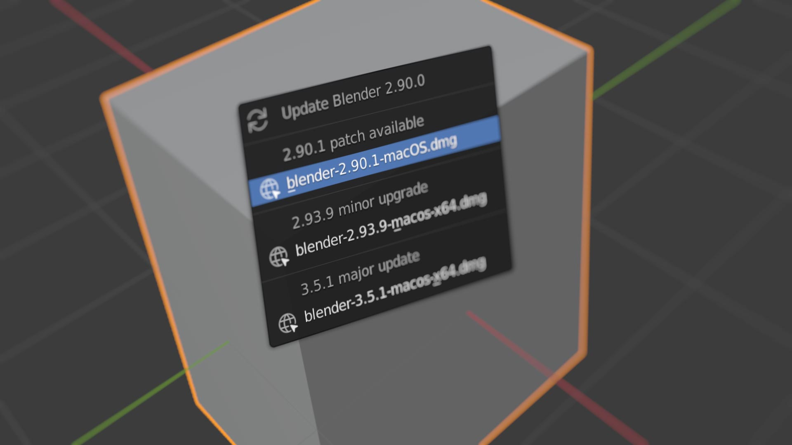

# AN7 Check For Blender Updates

Check for Blender patch updates from the Help menu and automatically on startup.

## Installation and Usage

 - Download the [AN7_checkForUpdates.py](https://raw.githubusercontent.com/iaian7/AN7-BlenderCheckForUpdates/main/AN7_checkForUpdates.py) add-on file
 - Install in the Blender Preferences > Add-ons tab
 - Enable the plugin
 - Choose the correct download type (this is not auto-detected and must be set manually)

- `Download Format` should be set to the preferred executable for your operating system.
	- In cases where the download link formatting is a little inconsistent (ending with `-macOS.dmg` instead of the more typical `-macos-arm.dmg` for example), the plugin will fall back to a simpler extension match instead of the full string. Each download is clearly listed in the update popup, so there shouldn't be any surprises.
- `Automatically Check` sets the types of updates to look for when Blender launches
	- `None` will skip checking for any updates on startup, but the `Help` menu `Check for Updates…` option will always be available
		- Once an update check is performed, the `Update` alert will show in the menu bar even after restarting Blender
		- If this is undesired behaviour, you can reset it simply by toggling the plugin checkbox off and back on
	- `Patch Updates` will check only for patch updates to the current Blender installation, not minor or major point releases
	- `All Updates (slow)` will check for all possible version updates

Checking for updates can take a few seconds depending on your computer or network speed, since multiple webpages have to be checked for available versions. Setting the `Automatically Check` setting to `None` or `Patch Updates` can help ensure Blender starts more quickly than when performing a full check for all three possible versions (3.3.#, 3.#.#, and #.#.# for example).

When an update is available, an alert will show up in the menu bar. Click this button to open the update popup with a download link (it'll download using your default browser), or access the same popup window at any time from the `Help` menu (this is an easy way to confirm you're running the latest available version if Blender hasn't been restarted in a while).

## Notes

- Tested in Blender 2.80, 2.90, and 3.5 for MacOS Intel, other versions and platforms should work but have not be tested
- This add-on is provided free and without warranty; use at your own risk