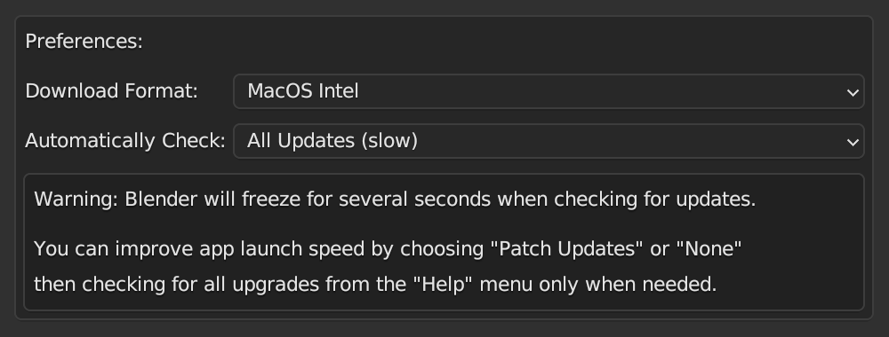

# AN7 Check For Blender Updates

Check for Blender patch updates from the Help menu and automatically on startup.

## Installation and Usage

 - Download the .py add-on file
 - Install in the Blender Preferences > Add-ons tab
 - Enable the plugin
 - Choose the correct download type (this is not auto-detected and must be set manually)

This add-on was built and tested in Blender 3.3.x on the MacOS Intel platform. It has not been tested on other platforms or non-LTS versions of Blender...backwards compatibility is spotty:
 - Blender 2.83: only works when accessed from the `Help` menu (does not register on startup)
 - Blender 2.93: fails due to an [SSL certificate issue](https://stackoverflow.com/questions/27835619/urllib-and-ssl-certificate-verify-failed-error)
 - Blender 3.3: works as expected

When automatically checking for updates on startup, Blender may try to download an available update regardless of where you click on the screen. Normally, simply moving the mouse away from the popup window would dismiss the popup, but when triggered on startup, that doesn't always work. It might be a weird bug with the button hover state in the Blender UI system, or I'm not very good with Python, not sure. Pressing the `escape` key will close the popup window without downloading.